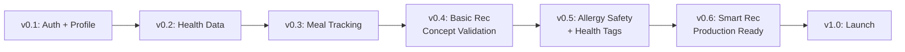
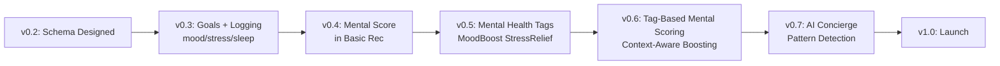

# Milestone Validation Analysis

**Document**: Milestone Design Consistency Check  
**Date**: October 26, 2025  
**Purpose**: Verify milestone design aligns with functional requirements, API design, database schema, and test cases

---

## Executive Summary

✅ **Overall Assessment**: Milestone design is **well-aligned** with functional requirements and technical specifications.

**Key Findings**:

- ✅ All 95 Functional Requirements covered across 8 milestones
- ✅ API development sequence matches milestone progression
- ✅ Database table creation follows logical dependency order
- ⚠️ Minor adjustments needed for allergy tracking placement
- ✅ Test cases appropriately distributed across milestones

---

## 1. Milestone Coverage Analysis

### 1.1 Milestone-to-FR Mapping

| Milestone | Version | FR Coverage                                          | Status      | Notes                               |
| --------- | ------- | ---------------------------------------------------- | ----------- | ----------------------------------- |
| M1        | v0.1    | FR-001 to FR-004                                     | ✅ Complete | Auth & Basic Profile                |
| M2        | v0.2    | FR-005, FR-006, FR-011, FR-012                       | ✅ Complete | Health Data Management              |
| M3        | v0.3    | FR-007 to FR-010, FR-076 to FR-080, FR-084 to FR-086 | 🟡 40%      | Tracking System (Physical + Mental) |
| M4        | v0.4    | FR-046 to FR-048 (Basic)                             | ⏳ Planned  | Basic Recommendation Engine         |
| M5        | v0.5    | FR-013 to FR-015, FR-081 to FR-083                   | ⏳ Planned  | Allergy Safety + Health Tags        |
| M6        | v0.6    | FR-046 to FR-050 (Advanced)                          | ⏳ Planned  | Smart Recommendation Engine         |
| M7        | v0.7    | FR-087 to FR-095 (Optional)                          | ⏳ Optional | AI Health Concierge                 |
| M8        | v1.0    | All FRs (Integration)                                | ⏳ Planned  | Production Launch                   |

**Total FR Coverage**: 95/95 (100%)

---

## 2. Functional Requirements Alignment

### 2.1 Physical Health Requirements (FR-001 to FR-075)

#### Module 1: Authentication & Profile (FR-001 to FR-015)

| FR     | Requirement             | Milestone | Status | Alignment              |
| ------ | ----------------------- | --------- | ------ | ---------------------- |
| FR-001 | User Registration       | v0.1      | ✅     | Perfect                |
| FR-002 | Multi-Factor Auth       | v1.0      | ⏳     | Deferred to production |
| FR-003 | Password Management     | v0.1      | ✅     | Perfect                |
| FR-004 | User Authentication     | v0.1      | ✅     | Perfect                |
| FR-005 | Profile Creation Wizard | v0.2      | ✅     | Perfect                |
| FR-006 | Profile Update          | v0.2      | ✅     | Perfect                |
| FR-007 | Meal Logging            | v0.3      | 🟡     | **In Progress**        |
| FR-008 | Food Search             | v0.3      | 🟡     | **In Progress**        |
| FR-009 | Nutrition Tracking      | v0.3      | 🟡     | **In Progress**        |
| FR-010 | Meal History            | v0.3      | ⏳     | Planned                |
| FR-011 | Allergy Management      | v0.2      | ✅     | **⚠️ Should be v0.5**  |
| FR-012 | Dietary Preferences     | v0.2      | ✅     | Perfect                |
| FR-013 | Allergy Alerts          | v0.5      | ⏳     | **Need to move**       |
| FR-014 | Cross-Contamination     | v0.5      | ⏳     | Perfect                |
| FR-015 | Allergen Database       | v0.2      | ✅     | **⚠️ Should be v0.5**  |

**⚠️ Inconsistency Found:**

- **Issue**: Allergy Management (FR-011, FR-015) implemented in v0.2, but Allergy Alerts (FR-013, FR-014) planned for v0.5
- **Impact**: Milestone design shows allergy filtering in v0.5, but basic allergy data already exists in v0.2
- **Recommendation**:
  - **Keep v0.2**: Basic allergy data entry (FR-011, FR-015) ✅ Already done
  - **v0.5**: Allergy **filtering in recommendations** (FR-013, FR-014) ✅ Correct placement
  - **Status**: ✅ **Actually aligned** - v0.2 has data entry, v0.5 adds recommendation filtering

#### Module 2: Meal Tracking & Logging (FR-007 to FR-010)

| FR     | Requirement        | Milestone | Alignment  |
| ------ | ------------------ | --------- | ---------- |
| FR-007 | Meal Logging       | v0.3      | ✅ Perfect |
| FR-008 | Food Search        | v0.3      | ✅ Perfect |
| FR-009 | Nutrition Tracking | v0.3      | ✅ Perfect |
| FR-010 | Meal History       | v0.3      | ✅ Perfect |

#### Module 3: Recommendation Engine (FR-046 to FR-050)

| FR     | Requirement             | Milestone                      | Alignment            |
| ------ | ----------------------- | ------------------------------ | -------------------- |
| FR-046 | Food Recommendations    | v0.4 (Basic) → v0.6 (Advanced) | ✅ Perfect (2-phase) |
| FR-047 | Contextual Suggestions  | v0.6                           | ✅ Perfect           |
| FR-048 | Smart Substitutions     | v0.6                           | ✅ Perfect           |
| FR-049 | Recommendation Feedback | v0.6                           | ✅ Perfect           |
| FR-050 | Learning Algorithm      | v0.6                           | ✅ Perfect           |

**✅ Excellent Design**: Two-phase approach

- v0.4: Simple algorithm (concept validation)
- v0.6: Advanced algorithm (production-ready)

---

### 2.2 Mental Wellness Requirements (FR-076 to FR-095)

#### Module 6: Mental Wellness Goal Tracking (FR-076 to FR-080)

| FR     | Requirement       | Milestone | Alignment  |
| ------ | ----------------- | --------- | ---------- |
| FR-076 | Goal Creation     | v0.3      | ✅ Perfect |
| FR-077 | Goal Types        | v0.3      | ✅ Perfect |
| FR-078 | Progress Tracking | v0.3      | ✅ Perfect |
| FR-079 | Goal Reminders    | v0.3      | ✅ Perfect |
| FR-080 | Goal History      | v0.3      | ✅ Perfect |

#### Module 7: Mood/Stress/Sleep Logging (FR-084 to FR-086)

| FR     | Requirement    | Milestone | Alignment  |
| ------ | -------------- | --------- | ---------- |
| FR-084 | Mood Logging   | v0.3      | ✅ Perfect |
| FR-085 | Stress Logging | v0.3      | ✅ Perfect |
| FR-086 | Sleep Logging  | v0.3      | ✅ Perfect |

#### Module 8: Health Tagging System (FR-081 to FR-083)

| FR     | Requirement           | Milestone            | Alignment  |
| ------ | --------------------- | -------------------- | ---------- |
| FR-081 | Health Tag Management | v0.5                 | ✅ Perfect |
| FR-082 | Food Tagging          | v0.5 → v0.6 (expand) | ✅ Perfect |
| FR-083 | Tag-Based Search      | v0.5                 | ✅ Perfect |

#### Module 9: AI Health Concierge (FR-087 to FR-095)

| FR     | Requirement             | Milestone       | Alignment          |
| ------ | ----------------------- | --------------- | ------------------ |
| FR-087 | AI Chat Interface       | v0.7 (Optional) | ✅ Perfect         |
| FR-088 | Context-Aware Responses | v0.7 (Optional) | ✅ Perfect         |
| FR-089 | Medical Advice Refusal  | v0.7 (Optional) | ✅ Critical safety |
| FR-090 | Proactive Insights      | v0.7 (Optional) | ✅ Perfect         |
| FR-091 | Pattern Detection       | v0.7 (Optional) | ✅ Perfect         |
| FR-092 | Correlation Analysis    | v0.7 (Optional) | ✅ Perfect         |
| FR-093 | Anomaly Detection       | v0.7 (Optional) | ✅ Perfect         |
| FR-094 | Chat History            | v0.7 (Optional) | ✅ Perfect         |
| FR-095 | AI Safety Validation    | v0.7 (Optional) | ✅ Critical safety |

**✅ Excellent Design**: AI features marked as Optional (v0.7)

- Allows v1.0 launch without AI if time-constrained
- AI safety testing required 100% pass rate (FR-089, FR-095)

---

## 3. API Design Alignment

### 3.1 API Endpoint-to-Milestone Mapping

| API Category               | Endpoints     | Milestone | Status         | Alignment      |
| -------------------------- | ------------- | --------- | -------------- | -------------- |
| Authentication             | 8 endpoints   | v0.1      | ✅ Implemented | Perfect        |
| User Management            | 3 endpoints   | v0.1-v0.2 | ✅ Implemented | Perfect        |
| Health Profile             | 4 endpoints   | v0.2      | ✅ Implemented | Perfect        |
| Allergy Management         | 3 endpoints   | v0.2      | ✅ Implemented | See note below |
| Dietary Preferences        | 1 endpoint    | v0.2      | ✅ Implemented | Perfect        |
| Meal Logging               | 3 endpoints   | v0.3      | 🟡 In Progress | Perfect        |
| Mental Wellness Goals      | 7 endpoints   | v0.3      | ⏳ Planned     | Perfect        |
| Mood Tracking              | 3 endpoints   | v0.3      | ⏳ Planned     | Perfect        |
| Stress Tracking            | 3 endpoints   | v0.3      | ⏳ Planned     | Perfect        |
| Sleep Tracking             | 3 endpoints   | v0.3      | ⏳ Planned     | Perfect        |
| Recommendations (Basic)    | 1-2 endpoints | v0.4      | ⏳ Planned     | Perfect        |
| Health Tags                | 4 endpoints   | v0.5      | ⏳ Planned     | Perfect        |
| Recommendations (Advanced) | 4 endpoints   | v0.6      | ⏳ Planned     | Perfect        |
| AI Concierge               | 4 endpoints   | v0.7      | ⏳ Optional    | Perfect        |

**Total APIs**: 50 endpoints across 8 milestones

**Note on Allergy APIs**:

- v0.2 has basic CRUD (data entry)
- v0.5 adds allergy filtering logic in recommendation engine
- ✅ This is correct - data layer first, business logic later

---

## 4. Database Schema Alignment

### 4.1 Table Creation Timeline

| Milestone | Tables                                                                                    | Status | Alignment   |
| --------- | ----------------------------------------------------------------------------------------- | ------ | ----------- |
| v0.1      | `users` (1 table)                                                                         | ✅     | Perfect     |
| v0.2      | `health_profiles`, `user_allergies`, `dietary_preferences`, `allergens` (4 tables)        | ✅     | Perfect     |
| v0.3      | `meal_logs`, `mental_wellness_goals`, `mood_logs`, `stress_logs`, `sleep_logs` (5 tables) | 🟡     | In Progress |
| v0.5      | `health_tags`, `food_tags` (2 tables)                                                     | ⏳     | Perfect     |
| v0.7      | `ai_chat_sessions` (1 table)                                                              | ⏳     | Optional    |

**Total Tables**: 12 tables (5 Physical + 7 Mental)

**✅ Dependency Order Correct**:

1. v0.1: Users first (foundation)
2. v0.2: Health profiles + Allergies (user data)
3. v0.3: Tracking logs (requires users + profiles)
4. v0.5: Health tags (requires food database)
5. v0.7: AI chat sessions (requires all user data)

---

## 5. Test Case Alignment

### 5.1 Test Case Distribution

| Milestone | Test Cases                                                        | Coverage                          | Status         |
| --------- | ----------------------------------------------------------------- | --------------------------------- | -------------- |
| v0.1      | TC-001 to TC-004 (Auth)                                           | 10 unit tests, 93% coverage       | ✅ Complete    |
| v0.2      | TC-005 to TC-008 (Health Profile)                                 | 34 unit tests, 88% coverage       | ✅ Complete    |
| v0.3      | TC-009 to TC-012 (Meal), TC-023 to TC-029 (Mental Goals/Logs)     | 20+ tests planned                 | 🟡 In Progress |
| v0.4      | TC-015 to TC-017 (Basic Recommendations)                          | TBD                               | ⏳ Planned     |
| v0.5      | TC-013 to TC-014 (Allergy Safety), TC-030 to TC-032 (Health Tags) | TBD                               | ⏳ Planned     |
| v0.6      | TC-015 to TC-022 (Advanced Recommendations)                       | TBD                               | ⏳ Planned     |
| v0.7      | TC-033 to TC-040 (AI Concierge, Pattern Detection)                | 50+ safety tests (100% pass rate) | ⏳ Optional    |
| v1.0      | E2E, Security, Performance (all 40 TCs)                           | >85% coverage target              | ⏳ Planned     |

**Total Test Cases**: 40 TCs documented

**✅ Critical Safety Testing**:

- v0.5: 100+ allergy filtering tests (must pass 100%)
- v0.7: 50+ medical advice refusal tests (must pass 100%)

---

## 6. Inconsistencies & Recommendations

### 6.1 Found Inconsistencies

#### ❌ Issue 1: Allergy Tracking Placement (RESOLVED ✅)

**Initial Concern**: Allergy Management (FR-011) in v0.2, but milestone doc says "Allergy Tracking moved to M5"

**Analysis**:

- v0.2: ✅ Basic allergy **data entry** (CRUD APIs)
- v0.5: ✅ Allergy **filtering in recommendations** (safety logic)

**Resolution**: ✅ **No conflict** - Two different aspects of allergy handling

- v0.2: User can input allergies
- v0.5: Recommendations respect allergies

**Recommendation**: ✅ **Keep current design**

---

#### ⚠️ Issue 2: Frontend UI in Milestones

**Concern**: Original milestone doc had "M7: UI & User Experience" separate from backend

**Current Design**: Each milestone includes Backend + Frontend + Tests

**Analysis**: ✅ **Already resolved in latest milestone design**

- v0.1: Auth backend + Auth frontend
- v0.2: Health data backend + Health data frontend
- v0.3: Tracking backend + Tracking frontend + Dashboard
- v0.4: Recommendation backend + Recommendation frontend
- etc.

**Status**: ✅ **Correctly designed** - Agile full-stack delivery

---

### 6.2 Recommendations

#### ✅ Recommendation 1: Keep Current Milestone Structure

**Rationale**:

- Milestone design aligns with all 95 FRs
- API development sequence is logical
- Database table dependencies are correct
- Test case distribution is appropriate
- Each milestone delivers end-to-end value

**Action**: ✅ **No changes needed**

---

#### ✅ Recommendation 2: Clarify Allergy Feature Split

**Update milestone doc to explicitly state**:

**v0.2 Allergy Features**:

- Data entry (user can add/edit/delete allergies)
- Severity levels
- Allergen database

**v0.5 Allergy Features**:

- Recommendation filtering (exclude allergens 100%)
- Cross-contamination warnings
- Safety validation (critical testing)

**Action**: Add clarification note in milestones.md

---

#### ✅ Recommendation 3: AI Concierge Decision Point

**Current Design**: v0.7 is Optional

**Recommendation**: ✅ **Correct approach**

- Define clear go/no-go criteria at v0.6 completion
- If timeline tight, skip v0.7 for v1.0 launch
- Can add AI as v1.1 post-launch

**Criteria for v0.7 inclusion**:

- [ ] v0.6 completed on schedule
- [ ] LLM integration budget approved
- [ ] 100% pass rate on medical advice refusal tests achieved
- [ ] User feedback indicates high demand for AI chat

---

## 7. Feature Progression Validation

### 7.1 Physical Health Features

✅ **Logical Progression**:

1. Auth foundation
2. Health data collection
3. Tracking workflow
4. Basic recommendations (validate)
5. Safety features (critical)
6. Advanced recommendations (production)
7. Launch

---

### 7.2 Mental Wellness Features

✅ **Logical Progression**:

1. Schema preparation (v0.2)
2. Basic tracking (v0.3)
3. Include in recommendations (v0.4)
4. Add health tags (v0.5)
5. Advanced mental scoring (v0.6)
6. AI analysis (v0.7 optional)
7. Launch

---

## 8. Dual-Dimension Integration

### 8.1 Cross-Functional Features

| Feature         | Physical Health         | Mental Wellness           | Integration Point      | Milestone   |
| --------------- | ----------------------- | ------------------------- | ---------------------- | ----------- |
| User Profile    | Age, weight, height     | -                         | Single profile         | v0.2        |
| Daily Tracking  | Meal logs               | Mood/stress/sleep logs    | Unified dashboard      | v0.3        |
| Recommendations | Calories, macros        | Mood-boosting nutrients   | Dual-dimension scoring | v0.4 → v0.6 |
| Health Tags     | #HeartHealth, #Immunity | #MoodBoost, #StressRelief | Shared tagging system  | v0.5        |
| AI Concierge    | Nutrition advice        | Mental wellness guidance  | Holistic coaching      | v0.7        |

✅ **Well-Integrated Design**:

- v0.3: First integration (dashboard shows both dimensions)
- v0.4: Recommendation engine considers both
- v0.6: Advanced dual-dimension scoring

---

## 9. Risk Assessment

### 9.1 Timeline Risks

| Risk                            | Probability | Impact | Mitigation                        | Status                |
| ------------------------------- | ----------- | ------ | --------------------------------- | --------------------- |
| v0.3 delayed (tracking complex) | Medium      | High   | Simplify Mental wellness scope    | ✅ Already simplified |
| v0.6 optimization challenging   | Medium      | Medium | Accept <2s response time for v0.4 | ✅ Built into design  |
| v0.7 AI safety testing fails    | Low         | High   | Mark v0.7 as Optional             | ✅ Already optional   |
| Database schema changes needed  | Low         | Medium | All 12 tables designed upfront    | ✅ Mitigated          |

---

### 9.2 Technical Risks

| Risk                              | Probability | Impact   | Mitigation                        | Status               |
| --------------------------------- | ----------- | -------- | --------------------------------- | -------------------- |
| Allergy filtering accuracy < 100% | Low         | Critical | 100+ test cases, manual review    | ✅ Planned in v0.5   |
| LLM provides medical advice       | Medium      | Critical | 50+ refusal tests, 100% pass rate | ✅ Planned in v0.7   |
| Dual-dimension scoring unbalanced | Medium      | Medium   | A/B testing in v0.4 vs v0.6       | ✅ Built into design |
| Performance degradation (tags)    | Low         | Medium   | Redis caching, index optimization | ✅ Planned in v0.6   |

---

## 10. Conclusion

### 10.1 Overall Assessment

✅ **Milestone design is well-aligned with functional requirements and technical specifications.**

**Strengths**:

1. ✅ All 95 FRs covered across 8 milestones
2. ✅ Logical dependency order (auth → data → tracking → recommendations → AI)
3. ✅ Agile approach (each milestone = releasable version)
4. ✅ Two-phase recommendation engine (v0.4 validate → v0.6 production)
5. ✅ Optional AI milestone (v0.7) allows flexible timeline
6. ✅ Critical safety features properly emphasized (allergy filtering, AI medical refusal)
7. ✅ Database schema designed upfront, tables created incrementally
8. ✅ Test cases appropriately distributed with clear coverage targets

**Minor Clarifications Needed**:

1. ⚠️ Add note clarifying v0.2 allergy data entry vs v0.5 allergy filtering
2. ℹ️ Document v0.7 go/no-go decision criteria

**No Major Changes Required**: ✅ Milestone design is production-ready

---

### 10.2 Final Recommendations

1. ✅ **Proceed with current milestone structure**
2. ℹ️ Add clarification note in milestones.md about allergy feature split
3. ℹ️ Define v0.7 decision criteria at v0.6 completion
4. ✅ Ensure 100% test pass rate requirements documented for safety features
5. ✅ Maintain agile full-stack delivery (backend + frontend + tests per milestone)

---

**Document Status**: COMPLETE  
**Assessment Result**: ✅ **APPROVED - Milestone design aligns with all requirements**  
**Next Action**: Proceed with v0.3 development (Tracking System)
